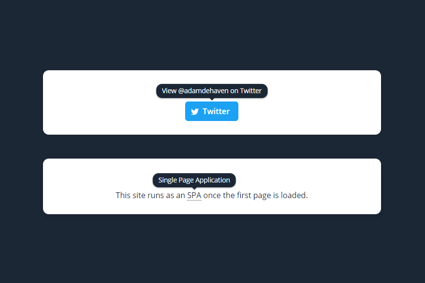

# Vue-Custom-Tooltip

A customizable, reusable, and reactive tooltip component for Vue (and VuePress) projects.



## Installation

```sh
# With npm
npm install @adamdehaven/vue-custom-tooltip

# or Yarn
yarn add @adamdehaven/vue-custom-tooltip
```

### Vue.js (Global Install)

It is recommended to install the plugin in your Vue project's entry file. For projects created with [`@vue/cli`](https://cli.vuejs.org/), this is likely your `main.js` file where you are already importing `Vue`.

```js
// main.js (or your Vue entry file)

// Import Vue... you're probably already doing this
import Vue from 'vue'

// Import the tooltip component before calling 'new Vue()'
import VueCustomTooltip from '@adamdehaven/vue-custom-tooltip'

// Install the plugin using ONE of the options below:
// --------------------------------------------------

// 1. Install with default options
Vue.use(VueCustomTooltip)

// ===== OR  =====

// 2. Install with custom options (defaults shown)
Vue.use(VueCustomTooltip, {
  name: 'VueCustomTooltip',
  color: '#fff',
  background: '#000',
  borderRadius: 12,
  fontWeight: 400,
})
```

### VuePress (Global Install)

> **VuePress Standalone Plugin**
>
> I have released a standalone VuePress plugin that wraps this component into an actual VuePress Plugin installable through the `.vuepress/config.js` or `.vuepress/theme/index.js` file. If you'd rather use the standalone plugin in your VuePress project, [head over to the `vuepress-plugin-custom-tooltip` repository](https://github.com/adamdehaven/vuepress-plugin-custom-tooltip).

For [VuePress](https://vuepress.vuejs.org/) projects, the `theme/enhanceApp.js` is a good location to initialize plugins.

```js
// theme/enhanceApp.js

// Import Vue... you're probably already doing this
import Vue from 'vue'

// Import the tooltip component
import VueCustomTooltip from '@adamdehaven/vue-custom-tooltip'

export default ({
  Vue, // the version of Vue being used in the VuePress app
  options, // the options for the root Vue instance
  router, // the router instance for the app
  siteData, // site metadata
  isServer, // is this enhancement applied in server-rendering or client
}) => {
  // ...apply enhancements to the app

  // Install the plugin using ONE of the options below:
  // --------------------------------------------------

  // 1. Install with default options
  Vue.use(VueCustomTooltip)

  // ===== OR  =====

  // 2. Install with custom options (defaults shown)
  Vue.use(VueCustomTooltip, {
    name: 'VueCustomTooltip',
    color: '#fff',
    background: '#000',
    borderRadius: 12,
    fontWeight: 400,
  })
}
```

### In-Component Install

Alternatively, you may install the component directly within a single file in your project; however, you will not be able to customize the `Vue.use()` options.

```html
<!-- Single file component -->

<script>
  // Import the tooltip component (no options available)
  import VueCustomTooltip from '@adamdehaven/vue-custom-tooltip'

  // .vue file default export
  export default {
    // Register the component
    components: {
      VueCustomTooltip,
    },
  }
</script>
```

**Note**: Installing inside a single component (instead of globally) does not allow you to customize the [Plugin Options](#options); however, you may still utilize all [`props`](#props) on the `<VueCustomTooltip>` element.

### CDN

Import the tooltip component after importing Vue in your file after importing Vue. Installing via CDN does not allow for customizing [Plugin Options](#options).

Installing via the CDN requires using the kebab-case component name.

```html
<!-- Import Vue -->
<script src="https://unpkg.com/vue/dist/vue.js"></script>
<!-- Import tooltip component -->
<script src="https://unpkg.com/@adamdehaven/vue-custom-tooltip"></script>

<!-- Then simply use the component -->
<p>This is a <vue-custom-tooltip label="Neat!" underlined>tooltip</vue-custom-tooltip>.</p>
```

### Manual

Download `dist/vue-custom-tooltip.min.js` and include it in your file after importing Vue. Installing manually does not allow for customizing [Plugin Options](#options).

Installing manually requires using the kebab-case component name.

```html
<!-- Import Vue -->
<script src="https://unpkg.com/vue/dist/vue.js"></script>
<!-- Import tooltip component -->
<script src="https://unpkg.com/@adamdehaven/vue-custom-tooltip"></script>

<!-- Then simply use the component -->
<p>This is a <vue-custom-tooltip label="Neat!" underlined>tooltip</vue-custom-tooltip>.</p>
```

## Usage

```html
<!-- Basic -->
What is <VueCustomTooltip label="This is a tooltip">a tooltip</VueCustomTooltip>?

<!-- With Props -->
What is
<VueCustomTooltip label="This is a tooltip" position="is-bottom" abbreviation sticky>a tooltip</VueCustomTooltip>?

<!-- With element(s) -->
<VueCustomTooltip label="View @adamdehaven on Twitter">
  <a class="button" href="https://twitter.com/adamdehaven">
    <span class="icon icon-twitter"></span>
    <span>Twitter</span>
  </a>
</VueCustomTooltip>
```

## Options

Pass any of the options listed below to `Vue.use(VueCustomTooltip, {...})` to customize the plugin for your project _(not available with [in-component installation](#in-component-install))_.

> **A note on options tied to CSS properties**
>
> The `color`, `background`, `borderRadius`, and `fontWeight` attributes listed below are set on the psuedo element using [CSS Variables (Custom Properties)](https://caniuse.com/#feat=css-variables), meaning they will fallback to their default values in unsupported browsers (e.g. Internet Explorer).

### `name`

- Type: `String`
- Default: `VueCustomTooltip`

Customize the name of the component you will use in your project. **Pascal-case names are preferred**, as this allows for pascal-case or kebab-case usage within your project.

```js
Vue.use(VueCustomTooltip, {
  name: 'SuperCoolTooltip', // pascal-case preferred
})
```

If you registered the name using pascal-case, you can reference the tooltip component via pascal-case _or_ kebab-case:

```html
<!-- Default name (user did not pass the 'name' option) -->

<!-- pascal-case -->
Nice <VueCustomTooltip label="Neat!">tooltip</VueCustomTooltip>!
<!-- kebab-case -->
Nice <vue-custom-tooltip label="Neat!">tooltip</vue-custom-tooltip>!

<!-- Custom name (allows user to rename component) -->

<!-- pascal-case -->
Nice <SuperCoolTooltip label="Neat!">tooltip</SuperCoolTooltip>!
<!-- kebab-case -->
Nice <super-cool-tooltip label="Neat!">tooltip</super-cool-tooltip>!
```

### `color`

- Type: `HEX Color`
- Default: `#fff`

Customize the color of the text displayed in the tooltip.

```js
Vue.use(VueCustomTooltip, {
  color: '#c1403d', // 3 or 6 digit HEX color, including a leading hash (#)
})
```

### `background`

- Type: `HEX Color`
- Default: `#000`

Customize the background color (and the `underlined` text color) of the tooltip.

```js
Vue.use(VueCustomTooltip, {
  background: '#1b2735', // 3 or 6 digit HEX color, including a leading hash (#)
})
```

### `borderRadius`

- Type: `Number`
- Default: `12`

Customize the border-radius of the tooltip. Must be an integer.

```js
Vue.use(VueCustomTooltip, {
  borderRadius: 4,
})
```

### `fontWeight`

- Type: `Number`
- Default: `400`

Customize the font-weight of the tooltip text. Must be an integer that is a multiple of 100, between 100 - 900.

```js
Vue.use(VueCustomTooltip, {
  fontWeight: 700,
})
```

## Props

In addition to the [Plugin Options](#options) above, you may also pass props to the component itself to customize both the look and behavior of the tooltip element.

Props that accept a Boolean value may be passed simply by adding the attribute to the component tag, if a `true` value is desired. See the `sticky` example here:

```html
<VueCustomTooltip label="Tooltip" sticky>text/element</VueCustomTooltip>
```

All other props may be passed as normal attributes (if the corresponding value is a String, like the `label` prop, shown above) or with `v-bind` directives, as shown here:

```html
<VueCustomTooltip :label="element.helpText" :sticky="false">text/element</VueCustomTooltip>
```

All available props for the tooltip component are listed below:

### `label`

- Type: `String`
- Default: `null`

The text that will display inside the tooltip. If the value for `label` is null, the tooltip will not be displayed.

You may **not** pass HTML to the label prop.

### `active`

- Type: `Boolean`
- Default: `true`

Determines whether the tooltip should display when hovered, or if the [`sticky`](#sticky) prop is present, if the tooltip should be visible.

### `position`

- Type: `String`
- Value: `is-top / is-bottom / is-left / is-right`
- Default: `is-top`

The position of the tooltip in relation to the text/element it is surrounding.

### `abbreviation`

- Type: `Boolean`
- Default: `false`

Swaps out the component's standard `<span>` element with a semantically-correct `<abbr>` element, and sets the [`underlined`](#underlined) prop to `true`. This is useful when adding a tooltip to text within a page's content where you want to provide additional context to a word or phrase, or provide a definition of a word or acronym.

```html
VuePress pages are served as an <VueCustomTooltip label="Single Page Application" abbreviation>SPA</VueCustomTooltip>.
```

### `sticky`

- Type: `Boolean`
- Default: `false`

Determines if the tooltip should always be displayed (including on component load/mounting), regardless of the element being hovered.

### `underlined`

- Type: `Boolean`
- Default: `false`

Add a dotted border under the contained text (the same color as the [background](#background) HEX value). This value is automatically set to `true` if the [`abbreviation`](#abbreviation) prop is set to `true`.

### `multiline`

- Type: `Boolean`
- Default: `false`

Allows the tooltip text to wrap to multiple lines as needed. Can be used in conjunction with the [`size`](#size) prop to adjust the width of the tooltip.

### `size`

- Type: `String`
- Value: `is-small / is-medium / is-large`
- Default: `is-medium`

The width of the tooltip, if the [`multiline`](#multiline) prop is set to `true`.

## Adding Custom Classes & Styles

Just like any other Vue component, you can add classes or styles directly to the component tag that will be applied to the rendered `<span>` tag (or `<abbr>` tag, if `abbreviation` is set to `true`).

```html
<!-- Tooltip component with custom classes and styles -->
<VueCustomTooltip class="your-class" :class="{ 'dynamic-class': isDynamic }" :style="{ display: 'inline' }" label="Neat"
  >text</VueCustomTooltip
>
```

This is extremely helpful if you want to extend functionality or tooltip styles within your project, which allows you to tweak things like the display behavior of the tooltip element.

The tooltip component is rendered as a `display: inline-block` element by default; however, you can override this by binding styles directly to the component, as shown above.

## License

[MIT](https://github.com/adamdehaven/vue-custom-tooltip/blob/master/LICENSE)
